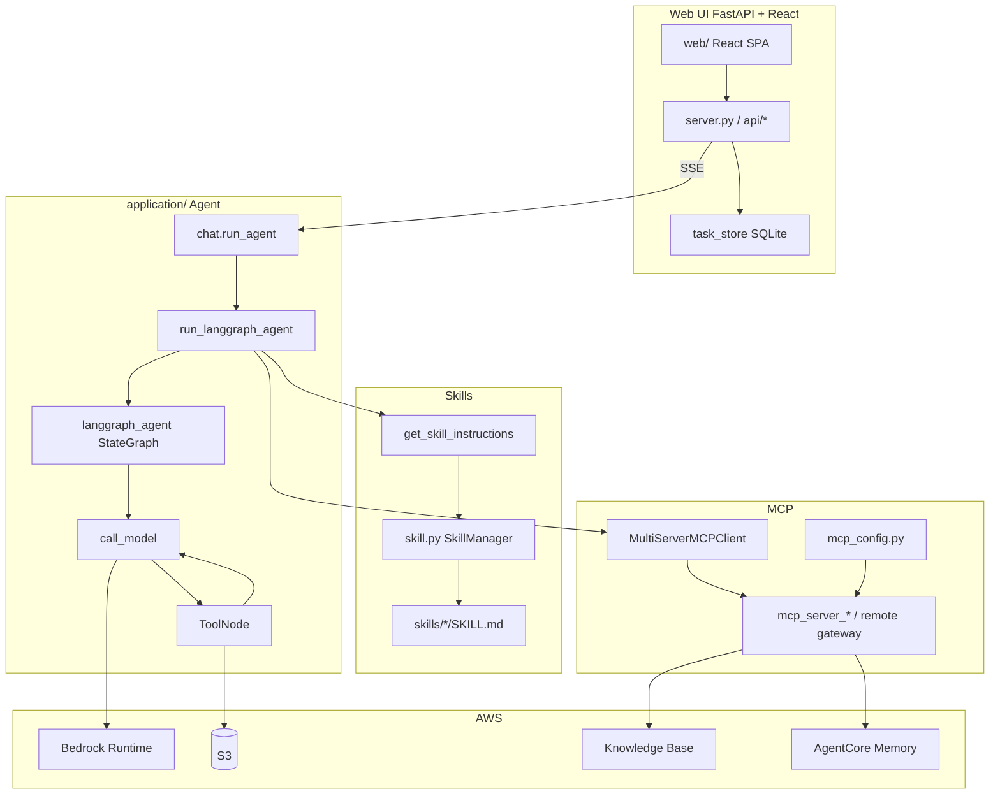

# ESS Project

Agent는 MCP뿐 아니라 [Skill](https://github.com/anthropics/skills)을 활용하여 다양한 기능을 편리하게 구현할 수 있습니다. 여기에서는 [LangGraph](https://www.langchain.com/langgraph)에서 Agent Skill을 활용하는 

## 개요

Web UI는 **FastAPI + React**이며, Agent는 **같은 프로세스**의 LangGraph로 실행합니다. 

| 구분 | 경로 | 역할 |
|------|------|------|
| Web UI | `application/server.py`, `application/web/` | Task·Chat·Skill/MCP 설정, SSE 스트리밍 |
| Agent | `application/chat.py` → `langgraph_agent.py` | LangGraph ReAct + MCP + Skills |
| 설정 | `application/config.json`, `mcp.list`, `skills.list` | 모델·MCP·Skill 기본값 |

```text
Browser (React :8501)
    │  REST + SSE (/api/...)
    ▼
FastAPI (application/server.py)
    │  chat.run_agent(...)
    ▼
LangGraph (langgraph_agent) + MCP + Skills + Bedrock
```

## 로컬 실행

```bash
# 프론트 빌드 후 FastAPI (포트 8501)
./run_local.sh

# 또는
cd application/web && npm install && npm run build && cd ../..
pip install -r requirements.txt
uvicorn application.server:app --host 0.0.0.0 --port 8501
```

브라우저: [http://localhost:8501](http://localhost:8501)

- 최초 접속 시 User ID를 입력하면 쿠키로 세션이 유지됩니다.
- `application/config.json`에 region, S3, Knowledge Base, Memory 등이 필요합니다. (`installer.py`로 생성 가능)
- Agent는 AgentCore Runtime이 아니라 **로컬 LangGraph**로 동작합니다.

프론트만 수정할 때:

```bash
cd application/web && npm run dev   # Vite :5173, /api → :8501 프록시
# 다른 터미널
uvicorn application.server:app --host 0.0.0.0 --port 8501
```

## Operation Architecture



| 기능 | 모듈 | 설명 |
|------|------|------|
| Chat (SSE) | `api/routes_chat.py` → `chat.run_agent` | Task별 스트리밍 대화 |
| Agent | `langgraph_agent` + MCP/Skills | ReAct 루프, checkpoint |
| 이미지 | `build_human_message_with_files` | 멀티모달 HumanMessage로 이미지 전달 |
| RAG 업로드 | `api/routes_rag.py` | 사용자별 S3 업로드 + metadata + Knowledge Base sync ([RAG](#rag)) |
| Memory | Sidebar Memory 토글 + MCP `memory` | AgentCore Memory 저장/조회 |

## Web UI

### 구성

| 레이어 | 스택 |
|--------|------|
| Backend | FastAPI, uvicorn (`application.server:app`, port **8501**) |
| Frontend | React 19 + TypeScript + Vite (`application/web/`) |
| 영속화 | SQLite `application/data/tasks.db` (로컬) |
| Auth | HttpOnly 쿠키 `agent_user_id` |

### 주요 API

| Method | Path | 설명 |
|--------|------|------|
| GET/POST/DELETE | `/api/session` | 사용자 세션 쿠키 |
| GET/PATCH | `/api/config` | 모델·Skill·MCP 목록/기본값 |
| CRUD | `/api/tasks` | Task 생성·수정·삭제 |
| POST | `/api/tasks/{id}/chat` | SSE 채팅 스트림 |
| POST | `/api/files/upload` | 이미지 S3 업로드 |
| POST | `/api/rag/upload` | RAG 문서 업로드·동기화 |
| GET | `/api/health` | 헬스체크 |

### UI에서 설정하는 항목

사이드바 / Config에서 Task마다 다음을 고릅니다.

- **Model** — Bedrock / Mantle 모델 표시명
- **Skills** — `application/skills.list` 기반 체크리스트
- **MCP servers** — `application/mcp.list` 기반 체크리스트
- **Memory** — 켜면 대화 저장 + `memory` MCP 자동 연결
- **Guardrail** — 설정된 경우 Bedrock Guardrail 적용

기본 Skill/MCP는 `config.json`의 `default_skills`, `default_mcp_servers`에 저장되며 Web UI에서 변경할 수 있습니다.

### 디렉터리 (application/)

```text
application/
├── server.py                 # FastAPI 진입점 + SPA 서빙
├── runtime_mode.py           # local: chat.run_agent
├── chat.py                   # LLM, create_agent, run_langgraph_agent
├── langgraph_agent.py        # StateGraph + builtin tools
├── skill.py / skills/        # SKILL.md 기반 스킬
├── mcp_config.py / mcp_server_*.py
├── task_store.py             # tasks.db
├── api/                      # routes_auth, chat, config, files, rag, tasks
├── web/                      # React SPA (src/, dist/)
├── mcp.list / skills.list
└── config.json               # (gitignore) AWS·KB·S3·API keys
```

## Agent Skills

[Agent Skills](https://agentskills.io/specification)은 AI agent에게 특정 작업 수행 방법을 가르치는 재사용 가능한 지침 패키지입니다. discovery → activation → execution 순으로 context를 관리합니다.

### Progressive Disclosure

시스템 프롬프트에는 스킬의 **이름과 설명만** XML로 넣고, 상세 지침은 agent가 `get_skill_instructions`로 **필요할 때만** 로드합니다.

```xml
<available_skills>
  <skill>
    <name>pdf</name>
    <description>PDF 파일 읽기/병합/분할/OCR/폼 처리 등</description>
  </skill>
</available_skills>
```

### 스킬 구조

```text
skills/
├── pdf/
│   ├── SKILL.md
│   └── assets/
├── pptx/
│   └── SKILL.md
└── skill-creator/
    └── SKILL.md
```

| 스킬 예 | 설명 |
|---------|------|
| pdf / docx / xlsx / pptx | 문서 생성·편집 |
| myslide | AWS 테마 프레젠테이션 |
| skill-creator | 새 스킬 설계·패키징 |
| memory-manager | MEMORY.md 기반 워크스페이스 메모리 |
| retrieve | Knowledge Base RAG |
| graphify | 지식 그래프 구축·질의 |

동작은 [skill.py](./application/skill.py)의 `SkillManager`가 담당합니다. Web UI Task에서 고른 skill 목록이 `build_skill_prompt()` → 시스템 프롬프트로 전달됩니다.

## LangGraph Agent

요청 흐름:

1. Web UI `POST /api/tasks/{id}/chat` (SSE)
2. `runtime_mode.run_agent` → `chat.run_agent`
3. 이미지 첨부가 있으면 `build_human_message_with_files`로 멀티모달 `HumanMessage` 구성
4. `create_agent` — builtin tools + 선택 MCP + skill tools
5. `langgraph_agent.buildChatAgentWithHistory` — checkpoint로 Task별 대화 유지
6. `astream(stream_mode="messages")` → notification queue → SSE (`token` / `tool` / `done`)

Builtin tools 예: `execute_code`, `write_file`, `read_file`, `bash`, `upload_file_to_s3`, `get_current_time`, `get_skill_instructions`

## MCP

선택 MCP는 `mcp_config.load_selected_config` → stdio 또는 AgentCore Gateway(`websearch`, SigV4)로 연결됩니다. 목록은 [application/mcp.list](./application/mcp.list)를 참고하세요.

대표적인 MCP:

- [RAG / knowledge base](https://github.com/kyopark2014/mcp/blob/main/mcp-rag.md) — Bedrock Knowledge Base
- [web_fetch](https://github.com/kyopark2014/mcp/blob/main/mcp-web-fetch.md) — URL → markdown
- [Notion](https://github.com/kyopark2014/mcp/blob/main/mcp-notion.md) / Slack / memory 등
- Skill: korea-weather (기상청 동네예보)

Gateway 기반 웹검색은 [websearch.md](./websearch.md)를 참조하세요.

## Memory

장기 기억은 [Amazon Bedrock AgentCore Memory](https://docs.aws.amazon.com/bedrock-agentcore/latest/devguide/memory.html)를 사용합니다.

Web UI에서:

1. Task의 **Memory** 토글을 켭니다 → `memory_enabled=true`, 필요 시 MCP `memory` 자동 추가
2. 대화 종료 후 `save_to_memory`로 short-term event 기록 → strategy가 long-term 추출
3. Agent는 MCP `recall_memory`(retrieve / list / get)로 조회만 수행

관련 코드: [mcp_server_memory.py](./application/mcp_server_memory.py), [mcp_memory.py](./application/mcp_memory.py), [agentcore_memory.py](./application/agentcore_memory.py)

워크스페이스 Markdown 메모리(`MEMORY.md`, `memory/*.md`)는 `memory-manager` 스킬과 함께 사용할 수 있습니다.

## RAG

Knowledge Base RAG는 **업로드(Web UI / application)** 와 **검색(MCP `kb-retriever` / `kb_retriever`)** 으로 나뉩니다.

| 역할 | 경로 | 설명 |
|------|------|------|
| 업로드 API | [routes_rag.py](./application/api/routes_rag.py) | `/api/rag/upload` — 세션 `user_id`로 업로드 |
| 업로드 오케스트레이션 | [rag_service.py](./application/services/rag_service.py) | S3 적재 + sidecar metadata + KB sync |
| S3 유틸 | [utils.py](./application/utils.py) | `docs/{projectName}/{user_id}/{file_name}` 키로 업로드 |
| 검색 MCP | [mcp_server_retrieve.py](./application/mcp_server_retrieve.py), [mcp_retrieve.py](./application/mcp_retrieve.py) | Bedrock `Retrieve` + metadata filter |
| MCP 등록 | [mcp_config.py](./application/mcp_config.py) (`kb-retriever` → `kb_retriever`) | `AGENTCORE_USER_ID`는 `chat.create_agent()`에서 주입 |

관련 AWS 문서:

- [Connect to Amazon S3 for your knowledge base](https://docs.aws.amazon.com/bedrock/latest/userguide/s3-data-source-connector.html) — `.metadata.json` sidecar
- [Configure and customize queries and response generation](https://docs.aws.amazon.com/bedrock/latest/userguide/kb-test-config.html) — metadata filtering operators
- [RetrievalFilter](https://docs.aws.amazon.com/bedrock/latest/APIReference/API_agent-runtime_RetrievalFilter.html) — API 필터 스키마

### 업로드와 S3 경로

로그인 `user_id`(예: Google 이메일 `user@example.com`)가 그대로 사용됩니다.

- 문서: `s3://{bucket}/docs/{projectName}/{user_id}/{file_name}`
- metadata sidecar: `s3://{bucket}/docs/{projectName}/{user_id}/{file_name}.metadata.json`

Knowledge Base data source는 `docs/{projectName}/` 접두사만 ingestion합니다. 이메일에는 `/`가 없으므로 S3 폴더명과 metadata `owner`, 검색 필터의 `user_id` 포맷이 동일합니다. 업로드 후 Knowledge Base data source sync(`StartIngestionJob`)를 시작합니다.

### Metadata filtering 소개

Bedrock Knowledge Base는 문서와 **같은 경로**에 `{원본파일명}.metadata.json`을 두면, ingestion 시 metadata attribute를 벡터 스토어에 저장합니다. Retrieve 시 `vectorSearchConfiguration.filter`로 이 속성을 필터링할 수 있습니다.

지원 타입: `STRING`, `NUMBER`, `BOOLEAN`, `STRING_LIST`  
주요 연산자 예:

| 연산자 | 용도 |
|--------|------|
| `equals` / `notEquals` | 값 일치 / 불일치 (`notEquals`는 **키가 없는 문서도 포함**) |
| `listContains` | `STRING_LIST`에 특정 값이 멤버로 포함되는지 |
| `greaterThan` 등 | 숫자 비교 |
| `andAll` / `orAll` | 조건 조합 |

`includeForEmbedding: false`이면 metadata는 **필터 전용**이고 임베딩에는 들어가지 않습니다. `true`이면 key-value가 chunk 텍스트에 이어져 임베딩에 반영됩니다.

**중요:** `.metadata.json`이 없는 문서는 해당 attribute가 `false`로 기본 세팅되지 않고 **속성 부재(absent)** 로 취급됩니다.

- `equals: is_confidential = false` → 속성 없는 문서는 **제외**
- `notEquals: is_confidential = true` → `false`인 문서 **및** 속성이 없는 문서 **포함**

### 현재 적용된 metadata

업로드 시 `rag_service.build_kb_metadata_document()`이 아래 sidecar를 생성합니다. 모든 attribute의 `includeForEmbedding`은 `false`입니다.

```json
{
  "metadataAttributes": {
    "owner": {
      "value": {
        "type": "STRING_LIST",
        "stringListValue": ["user@example.com"]
      },
      "includeForEmbedding": false
    },
    "team": {
      "value": { "type": "STRING", "stringValue": "mycompany" },
      "includeForEmbedding": false
    },
    "created_time": {
      "value": { "type": "NUMBER", "numberValue": 1754120285 },
      "includeForEmbedding": false
    },
    "is_confidential": {
      "value": { "type": "BOOLEAN", "booleanValue": false },
      "includeForEmbedding": false
    }
  }
}
```

| 필드 | 타입 | 기본값 | 비고 |
|------|------|--------|------|
| `owner` | `STRING_LIST` | 업로드한 `user_id` 1명 | 여러 owner 등록 가능 |
| `team` | `STRING` | `mycompany` | |
| `created_time` | `NUMBER` | Unix epoch(초) | `greaterThan` / `lessThan` 범위 필터 가능 |
| `is_confidential` | `BOOLEAN` | `false` | 공유/비기밀 문서 구분용 |

실제 Vector Store에 들어간 데이터는 아래와 같습니다. owner, team, created_time, is_confidential이 meta로 등록됩니다.


### 현재 적용된 검색 필터

`mcp_retrieve.retrieve()`는 MCP 프로세스 env의 `AGENTCORE_USER_ID`를 읽고, 없으면 검색을 거부합니다.  
`chat.create_agent()`가 `memory`와 같이 `kb_retriever`에도 `AGENTCORE_USER_ID`를 주입합니다.

현재 기본 필터는 **본인 문서만**:

```json
{
  "listContains": {
    "key": "owner",
    "value": "user@example.com"
  }
}
```

### 향후 옵션: 비기밀(또는 metadata 없는) 문서

`is_confidential`이 `false`이거나 metadata가 없어 속성이 없는 문서까지 검색하려면 `equals false`가 아니라 `notEquals true`를 사용합니다.

```json
{
  "notEquals": {
    "key": "is_confidential",
    "value": true
  }
}
```

의미:

- `is_confidential == false` → 포함
- `is_confidential` 속성 없음 (구버전/수동 업로드) → 포함
- `is_confidential == true` → 제외

owner 스코프와 함께 쓰려면 `andAll`로 조합합니다.

```json
{
  "andAll": [
    {
      "listContains": {
        "key": "owner",
        "value": "user@example.com"
      }
    },
    {
      "notEquals": {
        "key": "is_confidential",
        "value": true
      }
    }
  ]
}
```

## Knowledge Graph

대화·코퍼스에서 엔티티·관계를 추출해 사용자별 지식 그래프를 만들고, Web UI의 Knowledge Graph 모달에서 탐색합니다. 파이프라인·용어 상세는 [graph/README.md](./graph/README.md)를 참고하세요.

### Graph Extraction

추출 결과(`graph.json`)는 HTML로 렌더되며, 그래프 화면 컨트롤에서 **시각화 패턴**을 고를 수 있습니다. 선택값은 사용자 `settings.json`의 `graph_pattern`에 저장되고, 재추출 없이 HTML만 다시 생성합니다.

**하이브리드 문서검색:** `application/config.json`의 `hybrid_graph_search`가 `"enable"`이면 Titan 임베딩 vector search로 시작 노드를 보강합니다(`graph/lib/embeddings.py`, `out/node_embeddings.json`). 그 외 값이면 lexical(label/본문)만 사용합니다.


| 패턴 | 메뉴 이름 | 파일 | 특징 |
|------|-----------|------|------|
| **pattern1** | Force Atlas | [pattern1_html.py](./graph/lib/pattern1_html.py) | `forceAtlas2Based` 레이아웃. 커뮤니티 색의 큰 노드·그림자, **컬러 곡선 엣지·화살표·관계 라벨**. 허브 중심 탐색에 적합. |
| **pattern2** | Neo4j Explore | [pattern2_html.py](./graph/lib/pattern2_html.py) | 어두운 캔버스, **작은 점 노드**, 얇은 회색 **곡선 엣지**, 허브만 라벨. Neo4j Explore/Bloom에 가까운 overview. |
| **pattern3** | Holistic View | [pattern3_html.py](./graph/lib/pattern3_html.py) | **어두운 배경**의 전체-fit overview. ellipse 노드에 라벨을 많이 표시하고, 회색 방향 엣지에 **관계명(예: `HAS_TAG`)** 을 항상 표시. Neo4j Browser holistic view 구성을 어두운 테마로 맞춘 형태입니다. |

공통 UI: 좌상단 **문서검색**(Enter로 쿼리, 검색창·결과가 하나의 카드), 좌하단 그룹 범례·`Browse all`(빈 캔버스 클릭으로 범례 토글), 우하단 패턴 전환·전체 보기·레이아웃 재정렬.

구현 디스패치: [patterns.py](./graph/lib/patterns.py) (`pattern1` \| `pattern2` \| `pattern3`).

## 배포하기

### 인프라

```bash
sudo yum install python3 python3-pip git docker -y   # EC2 예
pip install boto3
git clone https://github.com/kyopark2014/agent-skills
cd agent-skills && python3 installer.py
```

제거: `python uninstaller.py`

### 애플리케이션

```bash
python -m venv .venv && source .venv/bin/activate
pip install -r requirements.txt
./run_local.sh
# Docker
# docker build -t agent-skills . && docker run -p 8501:8501 ...
```

컨테이너는 `uvicorn application.server:app --host 0.0.0.0 --port 8501`로 기동하며, 헬스체크는 `GET /api/health`입니다.

## Telegram / Discord

Web UI와 별도로 봇을 실행할 수 있습니다. 동일하게 `chat.run_langgraph_agent`를 호출합니다.

```bash
cd application
python telegram_bot.py
python discord_bot.py
```

Telegram Token은 [@BotFather](https://t.me/BotFather)에서 발급 후 `installer.py` / Secrets Manager로 등록합니다.

명령 예:

```text
/start
/model Claude 4.6 Sonnet
/mcp
```

## 실행 결과

"knoledge base" MCP를 선택한 후에 "위험저감분석(HMA)을 작성하는 방법을 설명하세요."라고 입력하면 아래와 같이 RAG를 조회하여 규격 문서를 참고로한 결과를 얻을 수 있습니다.


## Reference

- [anthropics / skills](https://github.com/anthropics/skills)
- [Agent Skills](https://agentskills.io/home)
- [Notion Skills for Claude](https://www.notion.so/notiondevs/Notion-Skills-for-Claude-28da4445d27180c7af1df7d8615723d0)
- [Claude Code Skills](https://support.claude.com/en/articles/12512176-what-are-skills)
- [Agent Skills for Strands Agents SDK](https://github.com/aws-samples/sample-strands-agents-agentskills)
- [Open Agent Skills](https://skills.sh/)
- [agentic-work](https://github.com/kyopark2014/agentic-work) — 상용 배포용 FastAPI UI + AgentCore Runtime
